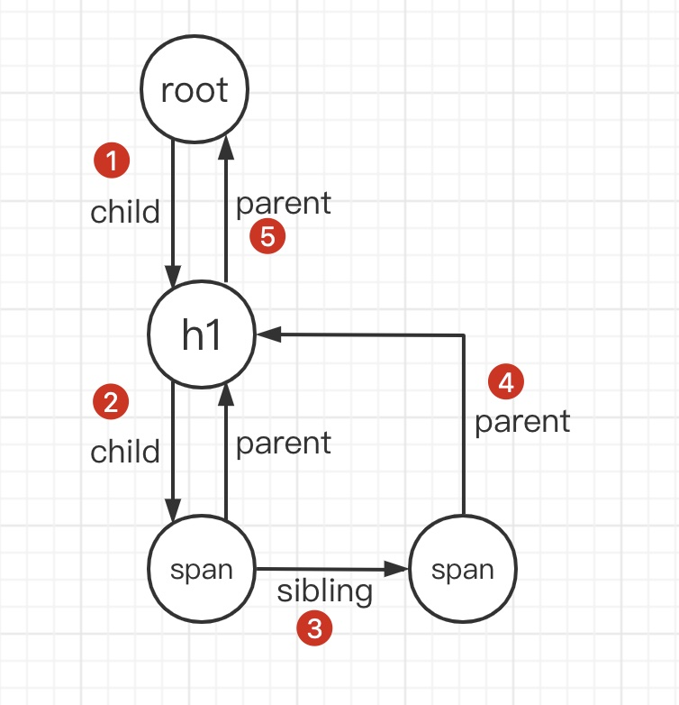
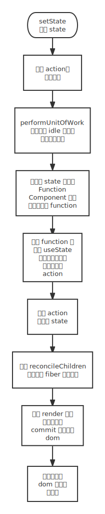

# 初探 React 设计思路

> 根据 [Build your own React](https://pomb.us/build-your-own-react/)，研究 React 16.8 的一些设计思路

## 背景知识

首先，我们从 React 的理念着手，在官网中，React 的理念是 **React is, in our opinion, the premier way to build big, fast Web apps with JavaScript**。

换言之，React 是一种用 javascript 搭建快速响应的大型 web 应用的库。

有了上述背景知识，我不禁好奇，我们为什么不用纯 JS 呢？React 到底在背地里做了哪些东西？

要了解这个，我们用一个 React 的 demo 来一步一步解释，demo 的目的在于往页面上 id 为 `root` 的元素挂一个 h1 标签：

```jsx
import React from 'react';
import ReactDOM from 'react-dom';

function App() {
  const element = <h1 className="greeting">Hello, world!</h1>
	const root = document.getElementById('root');
  ReactDOM.render(element, root);
}
```

可以看到这个脚本总共需要分成三步:

1. 首先使用 jsx 语法生成一个 h1 标签
2. 然后根据 id 获取指定元素
3. 最后调用 render 方法将 h1 标签挂载到指定元素下

下面我们将详细讲一下 React 在第一步跟第三步分别做了什么

### JSX 简介

JSX 是一种 JS 的语法扩展，支持用类 html 语法的方式在 JS 中书写 React 元素。

事实上，JSX 语法通过 babel 或者 tsc 编译后，会被编译成 `React.createElement` 方法（React 17 版本之后引入了一个新的 JSX 转换模式，但是是可选的升级，有兴趣的朋友可以看看 [这里](https://reactjs.org/blog/2020/09/22/introducing-the-new-jsx-transform.html) ）

```jsx
// 正常的 jsx 语法
const element = (
  <h1 className="greeting">
    Hello, world!
  </h1>
);

// 经由 babel 转换后的 jsx 语法
const element = React.createElement(
  'h1', 
  {className: 'greeting'}, 
  'Hello, world!'
)

// createElement 方法最后返回一个 React 元素（简化版）
const element = {
  type: 'h1',
  props: {
    className: 'greeting',
    children: 'Hello, world!',
  }
}
```

### ReactDOM.render 简介

我们先来看看 render 函数的原型：

```js
render(element, container[, callback])
```

从原型中不难看出，第一个参数是一个 React 元素；第二个参数是用来承载它的 dom 元素；第三个参数则是渲染或更新成功的回调函数

在上述的例子中，我们要讲创建出来的 React 元素挂载到 root 元素上还剩下两步：

1. 根据 React 元素创建真正的 dom 元素
2. 把创建好的 dom 元素挂载到 root 元素上

```jsx
function App() {
  // 为了方便观察我直接把 creatElement 方法的结果写在这里了
  const element = {
    type: 'h1',
    props: {
      className: 'greeting',
      children: 'Hello, world!',
    }
  }
	const root = document.getElementById('root');

  // ============== ReactDOM.render ==============
  // 根据 React 元素创建 dom 元素
  const dom = document.createElement(element.type);
  dom.className = element.props.className;
  const text = document.createTextNode(element.props.children);
  
  // 挂载元素
  dom.appendChild(text);
  root.appendChild(dom);
}
```

综上，我们知道了 jsx 跟 render 方法背后的思想，接下来是时候开始一步一步手写一个我们自己的 React 了。


## createElement

让我们从一个简单的例子开始理解 babel 是怎么转换 jsx 的吧：

```jsx
// jsx
const element = <h1>Hello world!</h1>

// result
var element = React.createElement("h1", null, "Hello world!"); 
```

[babel 示例](https://babeljs.io/repl#?browsers=defaults%2C%20not%20ie%2011%2C%20not%20ie_mob%2011&build=&builtIns=false&corejs=false&spec=false&loose=false&code_lz=MYewdgzgLgBApgGzgWzmWBeGAeAFgRgD4AJRBEGAdxACcEATAQmwHoDCg&debug=false&forceAllTransforms=true&shippedProposals=false&circleciRepo=&evaluate=false&fileSize=false&timeTravel=false&sourceType=module&lineWrap=true&presets=env&prettier=false&targets=&version=7.18.13&externalPlugins=babel-plugin-transform-react-jsx%406.24.1&assumptions=%7B%7D)

<br />

加一点点属性：

```jsx
// jsx
const element = <h1 className='greeting' onClick={()=>{}}>Hello world!</h1>

// result
var element = React.createElement("h1", {
  className: 'greeting',
  onClick: function onClick() {}
}, "Hello world!");
```

[babel 示例](https://babeljs.io/repl#?browsers=defaults%2C%20not%20ie%2011%2C%20not%20ie_mob%2011&build=&builtIns=false&corejs=false&spec=false&loose=false&code_lz=MYewdgzgLgBApgGzgWzmWBeGAeAFgRhmAQEMIIA5E1DAcgHMAnOOKASzHtpnAGEE2wANYYA3gAoAlBgB8ogL7yZACUQIQMAO4hGCACYBCbAHoCMoA&debug=false&forceAllTransforms=true&shippedProposals=false&circleciRepo=&evaluate=false&fileSize=false&timeTravel=false&sourceType=module&lineWrap=true&presets=env&prettier=false&targets=&version=7.18.13&externalPlugins=babel-plugin-transform-react-jsx%406.24.1&assumptions=%7B%7D)

<br />

加一些子节点：

```jsx
// jsx
const element = <h1 className='greeting' onClick={()=>{}}>Hello world! <span>:)</span></h1>
      
// result
var element = React.createElement("h1", {
  className: 'greeting',
  onClick: function onClick() {}
}, "Hello world! ", React.createElement("span", null, ":)"));
```

[babel 示例](https://babeljs.io/repl#?browsers=defaults%2C%20not%20ie%2011%2C%20not%20ie_mob%2011&build=&builtIns=false&corejs=false&spec=false&loose=false&code_lz=MYewdgzgLgBApgGzgWzmWBeGAeAFgRhmAQEMIIA5E1DAcgHMAnOOKASzHtpnAGEE2wANYYA3gAoAlBgB8ogL7yZACUQIQMAO4hGCACYBCHBAAOJMDIBck7AHpT5mXYIygA&debug=false&forceAllTransforms=true&shippedProposals=false&circleciRepo=&evaluate=false&fileSize=false&timeTravel=false&sourceType=module&lineWrap=true&presets=env&prettier=false&targets=&version=7.18.13&externalPlugins=babel-plugin-transform-react-jsx%406.24.1&assumptions=%7B%7D)

可以看出来，babel 会将 jsx 的标签名称以字符串的形式传入 createElement 的第一个参数；将标签的属性构造成对象传入第二个参数；将标签的子元素依序传入，如果遇到其他 jsx 元素，也会为新的元素调用 createElement

<br />

接着，回到 `createElement` 方法，我们已经知道，这个方法的目的在于根据解析完的 JSX 构建一个 React 元素，让我们先看看它的原型

```jsx
React.createElement(type, [props], [...children])
```

可以看到它接受三个参数：

1. `type`：要返回的 React 元素类型，可以是 html 标签（字符串）或者是 React Component 以及 React Fragment
2. `props`：可选，元素的属性，包括但不限于 className, style, eventListener……
3. `children`：可选，元素的子节点

<br />

于是，我们就可以写下第一版的 createElement 了：

```jsx
function createElement(type, props, ...children) {
  return {
    type, {
    props: ...props,
    children
  	}
  }
}
```

第一版完成了大部分的工作，但还不够完美。

<br />

我们知道，children 这个属性有两种可能性：代表另一个元素的对象，或原始值（比如字符串或者数字）。

为了方便处理，我们可以把原始值也封装成对象（React 是没有这种操作的，但是为了简化实现，这种写法更便于理解）：

```jsx
function createElement(type, props, ...children) {
	return {
		type, props: {
			...props,
			children: children.map(child => {
				return typeof child === 'object' ?
					child : createTextElement(child)
			}),
		}
	}
}

function createTextElement(text) {
	return {
		type: 'TEXT_ELEMENT',
		props: {
			nodeValue: text,
			// 文字元素没有子元素
			children: [],
		}
	}
}
```

到此，我们自己的 `createElement` 方法已经完成了，可以封装一个 `myReact` 对象然后让 jsx 试着帮我们编译了：

```jsx
/** @jsxRuntime classic */

const myReact = {
	createElement
}

// 制定 jsx 解析方式
/** @jsx myReact.createElement */
const element = <h1 className='greeting' onClick={()=>{}}>Hello world! <span>:)</span></h1>
      
console.log(element);
// {
// 	type: 'h1',
// 	props: {
// 		className: 'greeting',
// 		onClick: () => { },
// 		children: [{
// 			type: 'span',
// 			props: {
// 				children: [{
// 					type: 'TEXT_ELEMENT',
// 					props: {
// 						nodeValue: ':)',
// 						children: [],
// 					},
// 				}]
// 			}
// 		}, {
// 			type: 'TEXT_ELEMENT',
// 			props: {
// 				nodeValue: 'Hello world! ',
// 				children: [],
// 			},
// 		}]
// 	}
// }
```

> 第一行之所以要加 @jsxRuntime classic 是告诉 jsx 要使用经典模式：也就是转换成 createElement 的模式，详情看 [这里](https://reactjs.org/blog/2020/09/22/introducing-the-new-jsx-transform.html)


## render

接下来，我们要实现 render 的方法，render 的职责主要有两个：挂载 dom 以及更新 dom。

### 挂载 dom

```jsx
function render(element, container) {
	// 区分两种元素，分别创建 dom 节点
	const dom = element.type === "TEXT_ELEMENT" ? document.createTextNode("") : document.createElement(element.type);

	// 处理元素的 props
	Object.keys(element.props).filter(key => key !== 'children').forEach(name => dom[name] = element.props[name]);

	// 根据递归关系构建整个 dom 树
	element.props.children.forEach(child => render(child, dom));

	// 挂载 dom 节点
	container.appendChild(dom);
}
```

尝试一下：

```jsx
/** @jsxRuntime classic */
const myReact = {
	createElement,
  render
}

      
function App() {
	const root = document.getElementById('root');

  // 制定 jsx 解析方式
  /** @jsx myReact.createElement */
  const element = <h1 className='greeting' onClick={()=>{}}>Hello world! <span>:)</span></h1>

	myReact.render(element, root);
}
```

到此为止，我们已经可以成功的在页面上渲染出我们想要的任意画面了。

下一步就要开始了解 react 是怎么更新 dom 节点的。

<br />

### 更新 dom

#### 背景知识

众所周知，react 16 在更新 dom 的部分重构了 15 的架构，引入了 scheduler 这个模块。

要了解 15 为什么需要重构，就得先了解 react 15 的架构存在什么痛点。

首先，react 15 的架构主要分为两个部分：**Reconciler** 和 **Renderer**

- Reconciler：**协调器**——负责进行协调算法（俗称 diff），目标是将一些平台无关的操作（如自定义组件、state、生命周期方法等）抽象出来，保证不同平台之间这些操作的一致性
- Renderer：**渲染器**——负责将协调器计算好有变化的元素渲染到真正的页面。渲染器并不是只有一个，根据渲染目标的不同，渲染器也有多个，比如在 dom 上就是 ReactDom、在原生场景中是 React Native、在测试环境中还能用 Test renderer 渲染成 JSON 树，详情可以看[这里](https://reactjs.org/docs/codebase-overview.html#renderers)

react 15 的架构痛点在于，当元素发生更新的时候，reconciler 与 renderer 会交替工作，并且以递归的方式更新子组件，这个操作在 react 中被称为 [Stack Reconciler](https://reactjs.org/docs/codebase-overview.html#stack-reconciler) 

上述两个痛点会导致两个问题：

1. 由于 reconciler 与 renderer 交替工作，所以如果页面中某一个元素的子组件过于臃肿导致在浏览器绘制周期（一般是 16ms，主流浏览器一般刷新率都是 60hz）内无法处理完，就会导致页面更新不一致的问题
2. 由于更新子组件是使用递归的模式，一旦开始更新变无法停止，当组件的层级很深的时候，会导致页面卡顿，降低用户体验

<br />

成也萧何，败也萧何。

既然 15 的痛点来自于浏览器绘制周期的限制，那如果我们可以设计一种机制，将本来应该连续做完的任务进行中断拆分，并且充分利用浏览器两次渲染之间的空闲时间执行任务是不是就能解决这个问题呢？

在了解这个思路的真正实践之前，我们先讲讲浏览器的 **事件循环（event loop）**

>  首先要澄清一个观念，虽然是事件循环，但是它的标准却是定义在 HTML 标准中的，有兴趣的朋友可以看看 [标准原文](https://html.spec.whatwg.org/multipage/webappapis.html#event-loops)

事件循环的执行过程，简单来说可以分成 4 个步骤：

1. 在**任务队列**的**任务源**中找出至少一个可执行的 Task，放到 `taskQueue` 中（如果没有可执行 Task，则直接跳到第 3 步）
2. 执行 `taskQueue` 中的 Task，如果执行过程中有 microtask 则将其放到微任务队列中
3. 执行**微任务队列**中的 **Microtask**
4. **更新渲染**，渲染完毕后重回步骤 1

下面我们来分别对上述流程中加粗的部分进行进一步讲解：

- 任务队列（Task queue）：虽然说是队列，但是它实际上是一个集合（Set）。所以事件循环在挑选 Task 的时候并不是按照 “先进先出” 的顺序来挑选的，而是优先挑选 “可执行的 Task”（具体实现由各个浏览器厂家决定）
- 任务源：任务队列有多个任务源。一般有：用户交互、网络请求、DOM 操作、历史遍历等等
- 微任务队列：独立于 Task queue 的队列。负责存放 Microtask
- Microtask：微任务。微任务会在 `taskQueue` 为空且控制权还未交还给事件循环的时候被触发。值得注意的是，事件循环在执行微任务的时候，会一直执行到微任务队列为空，如果**调度了大量的微任务会导致后面的任务得不到执行，后面的渲染任务也会因此而被阻塞。**
- 更新渲染：更新渲染可以简单理解为页面的绘制与重绘。值得注意的是，虽然它是在事件循环的第四步，但**并不是每一次事件循环都会执行渲染**。一般来说，浏览器的刷新率是 60hz，也就是一帧 16.6ms。但是当一些原因（比如上述微任务阻塞），会导致浏览器无法维持 60fps，也就会造成所谓的卡顿

上面讲了这么多，但是实际总结起来，要想要让画面流畅，只需要做到两点就好：

1. 对于低优且耗时的任务（比如计算），可以拆分成多段分散到渲染之间的 16ms 中处理
2. 对于高优的任务（比如动画），尽量集中在两次渲染之间完成

那么要如何做好这两点呢？其实浏览器已经有现成的方法了：

- requestIdleCallback：它会在浏览器执行完渲染任务，且 cpu 空闲时被调用，刚好符合我们处理低优任务的需求
- requestAnimationFrame：它会在每次绘制之前被执行，刚好符合我们处理高优任务的需求

接下来让我们看看 react 团队时如何将这两种方法应用到 16 的新架构中的吧！

<br />

react 16 的架构被称之为 [Fiber Reconciler](https://zh-hans.reactjs.org/docs/codebase-overview.html#fiber-reconciler)

**Fiber reconciler** 的架构在 15 之外新增了一个 **Scheduler**，并且对 **Reconciler** 和 **Renderer** 做了适度调整：

- Scheduler：**调度器**——负责从宏观跟微观对任务调度进行管控。从宏观上，根据优先级来调度多个任务的执行顺序；从微观上，及时中断耗时的单个任务，并在后续恢复执行。其中涉及到了**优先级**以及**时间片**的概念。
- Reconciler：**协调器**——负责任务的切片（创建一个个 fiber），并根据优先级在 Scheduler 中注册，等待调度。在 Scheduler 将任务交给 Reconciler 后，负责对更新的虚拟 dom 节点打上 **增/删/更新** 的标记。只有当所有的组件都完成了 Reconciler 之后才会被统一交给 Renderer 执行 commit 操作。
- Renderer：**渲染器**——它将根据 reconciler 打完的标记 **同步** 执行对应的 dom 操作
- **由于 Scheduler 和 Reconciler 的工作都在内存中执行，不会呈现在页面上，所以即使反复中断，也不会影响到用户实际看到的页面**

<br />

#### 重构旧架构

了解了上述的背景知识之后，我们要开始实现属于我们自己的简化版 Fiber Reconciler 了

> react 基于某些原因自己重写了 requestIdleCallback 与 requestAnimationFrame，但是为了方便理解我们就直接用了

首先我们需要为可分片的任务搭建一个运行框架：

```js
// 标记下一次 idle 要执行的任务
let nextUnitOfWork = null

/**
 * @desc 负责判断是否要执行该段任务
 * @param deadline requestIdleCallback传入的参数，表示当前这个 idle 还剩下多少时间
 */
function workLoop(deadline) {
  let shouldYield = false
  // 如果当前还有时间且还有可执行的任务才执行
  while (nextUnitOfWork && !shouldYield) {
    nextUnitOfWork = performUnitOfWork(
      nextUnitOfWork
    )
    shouldYield = deadline.timeRemaining() < 1
  }
  // 持续注册任务，保证这个执行链路能一直运行
  requestIdleCallback(workLoop)
}

// 给下一个 idle 注册一个任务
requestIdleCallback(workLoop)

// 做两件事：执行当前 fiber 的操作、返回下一阶段工作
function performUnitOfWork(nextUnitOfWork) {
  // TODO
}
```

接下来我们要想办法将原来的递归任务拆解，紧接而来的第一个问题就是，要怎么拆解呢？

让我们先复习一下之前的递归都做了什么：根据**每一个节点**，检查它与之前的区别，然后对其做对应的 增/删/改 操作，最后将其挂载到 dom 树上

可以看到，每次递归处理的都是单个节点，那么我们可不可以把每个节点与其对应的操作抽象出来呢？

抽象出来的东西，我们就叫它 **fiber** 吧！

最后还有一个问题：之前的递归架构中，自然的在堆栈中保存了每个节点的父子关系，现在把每个节点单独抽象出来之后，我们需要额外的信息来记录他们之间的关系。链表似乎是个不错的选择🤔

举个例子，我们有一个 element：

```jsx
const element = <h1 className='greeting' onClick={() => { }}>
  	<span>Hello world! </span>
		<span>:)</span>
</h1>
```

它的 fiber 树看起来是这个样子的（里面的数字顺便标注了 fiber tree 的遍历过程）：



总结一下，我们目前的 fiber 看起来大概像这样：

```js
const fiber = {
  // 记录原来节点的信息
  type: null,
  dom: null,
  props: {
    className: null,
    // 记录与其他 fiber 的关系
    children: null
  },
  
  // 记录与其他 fiber 的关系
  parent: null,
  sibling: null,
}
```

<br />

还记得我们在 **挂载 dom** 这一节的 render 函数长什么样子么？

在之前，我们把创建 dom 节点与挂载 dom 节点耦合在一起了，现在是时候把他们分开了：

```js
/**
 * @desc 根据 fiber 构建 dom 树
 * @param fiber fiber 可以看成一个 dom 节点，区别在于它有 child, sibling, parent 三个指针
 */
function createDom(fiber) {
  // 区分两种元素，分别创建 dom 节点
  const dom = fiber.type === "TEXT_ELEMENT" ? document.createTextNode("") : document.createElement(fiber.type);

  // 处理元素的 props
  Object.keys(fiber.props).filter(key => key !== 'children').forEach(name => dom[name] = fiber.props[name]);

  return dom;
}

/**
 * @desc 把 fiber tree 的 root 节点赋值给 nextUnitOfWork
 */
function render(element, container) {
  // fiber 的 dom 属性指向对应的 dom 节点
  nextUnitOfWork = {
    dom: container,
    props: {
      children: [element],
    },
  }
}
```

从上述代码可以看出，我们通过把 fiber tree 的根节点赋值给 nextUnitOfWork，最后浏览器就会在空闲时候调用 performUnitOfWork 函数了，所以接下来我们要来看看 performUnitOfWork 到底是如何处理 fiber 的：

```js
/**
 * @desc 做两件事：执行当前 fiber 的操作、返回下一阶段工作
 * @param fiber 
 */
function performUnitOfWork(fiber) {
  // 如果当前 fiber 还没有对应的 dom 元素，则创建一个
  if (!fiber.dom) {
    fiber.dom = createDom(fiber);
  }
  // 建立 fiber.dom 之间的联系
  if (fiber.parent) {
    fiber.parent.dom.appendChild(fiber.dom);
  }

  // 为当前 fiber 的子节点创建 fiber
  const elements = fiber.props.children;
  let index = 0;
  let prevSibling = null;
  while (index < elements.length) {
    const element = elements[index];
    const newFiber = {
      type: element.type,
      props: element.props,
      parent: fiber,
      // 新的 fiber 自然没有 dom 元素，留到下一个分段再创建
      dom: null,
    }

    if (index === 0) {
      // 如果是当前 fiber 的第一个子节点，就设置当前 fiber 的 child 指针
      fiber.child = newFiber;
    } else {
      // 否则就设置为上一个节点的兄弟节点
      prevSibling.sibling = newFiber;
    }
    prevSibling = newFiber;
    index++;
  }

  // 处理完当前 fiber，要返回需要处理的下一个 fiber：顺序为 child -> sibling -> uncle(parent)
  if (fiber.child) {
    return fiber.child;
  }
  let nextFiber = fiber;
  while (nextFiber) {
    if (nextFiber.sibling) {
      return nextFiber.sibling;
    }
    nextFiber = nextFiber.parent;
  }
}
```

到目前为止，我们已经完成了对单个 fiber 操作的抽象，但是还有一个问题。

记得之前 Stack Reconciler 的第一个痛点嘛？

由于 Stack Reconciler 中的 render 跟 commit 阶段是交替进行的，所以如果在一帧之间没办法做完整个计算，就会导致页面渲染不完全的问题。

所以我们的下一步，就是要将 render 跟 commit 阶段分开。

首先要先把操作 dom 的部分从 performUnitOfWork 中删除

```js
function performUnitOfWork(fiber) {
  if (!fiber.dom) {
    fiber.dom = createDom(fiber);
  }

  // 删除这个部分
  // if (fiber.parent) {
  //   fiber.parent.dom.appendChild(fiber.dom);
  // }

  const elements = fiber.props.children;
  let index = 0;
  let prevSibling = null;
  while (index < elements.length) {
    const element = elements[index];
    const newFiber = {
      type: element.type,
      props: element.props,
      parent: fiber,
      dom: null,
    }

    if (index === 0) {
      fiber.child = newFiber;
    } else {
      prevSibling.sibling = newFiber;
    }
    prevSibling = newFiber;
    index++;
  }

  if (fiber.child) {
    return fiber.child;
  }
  let nextFiber = fiber;
  while (nextFiber) {
    if (nextFiber.sibling) {
      return nextFiber.sibling;
    }
    nextFiber = nextFiber.parent;
  }
}
```

接下来，我们希望 commit 阶段的事情是在 render 完了之后执行的，所以第一步是要记录下来 fiber 的根节点，在这里为了方便我们直接用了一个全局变量来做记录

```js
// 所有 fiber 的 root
let wipRoot = null;

function render(element, container) {
  // 记录 fiber 的 root
  wipRoot = {
    dom: container,
    props: {
      children: [element],
    },
  }
	
  nextUnitOfWork = wipRoot;
}
```

下一步，就是要在 render 阶段之后在执行 commit 的任务

```js
function workLoop(deadline) {
  let shouldYeild = false;
  while (nextUnitOfWork && !shouldYeild) {
    nextUnitOfWork = performUnitOfWork(nextUnitOfWork);
    shouldYeild = deadline.timeRemaining() < 1;
  }

  // 如果所有 render 阶段都完成了的话，才挂载开始 commit 阶段
  if (!nextUnitOfWork && wipRoot) {
    // TODO
    commitRoot();
  }

  requestIdleCallback(workLoop);
}
```

最后一步，当然就是开始实现 commitRoot 啦

```js
/**
 * @desc 根据 wipRoot 挂载整个 dom
 */
function commitRoot() {
  commitWork(wipRoot.child);
  wipRoot = null;
}

/**
 * @desc 递归挂载 fiber 的 dom
 * @param fiber 
 */
function commitWork(fiber) {
  if (!fiber) {
    return;
  }
  const domParent = fiber.parent.dom;
  domParent.appendChild(fiber.dom);
  commitWork(fiber.child);
  commitWork(fiber.sibling);
}
```

恭喜 🎉 到目前为止，我们已经完成了对于之前架构的重构了

<br />

#### Reconciler

接下来，就要开始考虑 dom 的更新与删除了

想要知道 dom 的更新与删除状态，首先就需要对比之前的 dom 与现在的 dom

那么，我们的第一步就是先把之前的 dom 给保存起来：

```js
// 保存当前的 wipRoot，用来跟之后的 wipRoot 做比较
let currentRoot = null;

function commitRoot() {
  commitWork(wipRoot.child);
  // 把当前的 fiber 保存起来方便之后对比
  currentRoot = wipRoot;
  wipRoot = null;
}

function render(element, container) {
  wipRoot = {
    dom: container,
    props: {
      children: [element],
    },
    // 建立与之前 fiber 之间的联系
    alternate: currentRoot,
  }
  deletions = [];
  nextUnitOfWork = wipRoot;
}
```

接下来，就是要为之前的 performUnitOfWork 增加调和子节点的功能了：

```js
function performUnitOfWork(fiber) {
  if (!fiber.dom) {
    fiber.dom = createDom(fiber);
  }

  const elements = fiber.props.children;

  // 用于调和子节点（也就是俗称的 diff）
  reconcileChildren(fiber, elements);

  if (fiber.child) {
    return fiber.child;
  }
  let nextFiber = fiber;
  while (nextFiber) {
    if (nextFiber.sibling) {
      return nextFiber.sibling;
    }
    nextFiber = nextFiber.parent;
  }
}

// TODO: 将旧的 fiber 跟新的 elements 对比
function reconcileChildren(wipFiber, elements) {}
```

下一步，需要实现 reconcileChildren 这个函数，其功能是比较同一层的新旧 fiber 之间的变化并为其打上标签

fiber 之间的变化可以简单的分为三种：

- 节点新增：在旧 fiber 上没有的节点出现在了新 fiber 中，这个时候要打上 **PLACEMENT** 标签
- 节点更新：新旧 fiber 上都有同一个节点，但是其属性发生了变更，需要打上 **UPDATE** 标签
- 节点删除：旧 fiber 上有的节点在新 fiber 中消失了，这个时候要打上 **DELETION** 标签

```js
/**
 * @desc 将旧的 fiber 跟新的 elements 对比（俗称的 diff 算法）
 * @param wipFiber 最新的 fiber
 * @param elements 最新的 fiber 的子节点
 */
function reconcileChildren(wipFiber, elements) {
  let index = 0;
  let oldFiber = wipFiber.alternate && wipFiber.alternate.child;

  let prevSibling = null;

  while (index < elements.length || oldFiber !== null) {
    const element = elements[index];
    let newFiber = null;

    const sameType = oldFiber && element && element.type === oldFiber.type;

    if (sameType) {
      // 如果两个的类型是一样的，我们只要更新属性就好了
      newFiber = {
        type: oldFiber.type,
        props: element.props,
        dom: oldFiber.dom,
        parent: wipFiber,
        alternate: oldFiber,
        effectTag: 'UPDATE',
      }
    }

    if (element && !sameType) {
      // 如果类型不一样，且有新的元素，我们需要创建一个新的节点
      newFiber = {
        type: element.type,
        props: element.props,
        dom: null,
        parent: wipFiber,
        alternate: null,
        effectTag: "PLACEMENT",
      }
    }

    // 如果类型不一样，且有一个旧节点，我们需要删除旧节点
    if (oldFiber && !sameType) {
      oldFiber.effectTag = 'DELETION';
      deletions.push(oldFiber);
    }


    if (index === 0) {
      // 如果是当前 fiber 的第一个子节点，就设置当前 fiber 的 child 指针
      wipFiber.child = newFiber;
    } else {
      // 否则就设置为上一个节点的兄弟节点
      prevSibling.sibling = newFiber;
    }
    prevSibling = newFiber;
    index++;
  }
}
```

注意到上面代码的 45 行，我们用了一个数组记录了要被删除的 fiber 节点的信息，为什么呢？

因为我们最后进入的 commit 阶段使用的是 wipRoot，也就是新的 fiber 根节点，而在上一个 fiber 中被删除的节点在新的 fiber 节点上是不存在的，因此我们需要用一个数组来保存被删除的 fiber 节点信息，这样才能在 commit 阶段找到对应的真实 dom 节点然后将其删除：

```js
// 用来追踪要删除的节点
let deletions = null;

function render(element, container) {
  wipRoot = {
    dom: container,
    props: {
      children: [element],
    },
    alternate: currentRoot,
  }
  
  // 每次 render 被调用都要先清掉上次 reconcile 的痕迹
  deletions = [];
  
  nextUnitOfWork = wipRoot;
}

function commitRoot() {
  // commit 阶段也要记得先删除标记的节点
  deletions.forEach(commitWork);
  commitWork(wipRoot.child);
  currentRoot = wipRoot;
  wipRoot = null;
}
```

到此，我们完成了 reconcile 的编写

<br />

#### Commit

还记得我们之前的 commitWork 函数吗？

```js
function commitWork(fiber) {
  if (!fiber) {
    return;
  }
  const domParent = fiber.parent.dom;
  domParent.appendChild(fiber.dom);
  commitWork(fiber.child);
  commitWork(fiber.sibling);
}
```

它完成了新增 dom 的任务，但是在我们完成了 Reconcolier 之后，简单的新增已经不能满足我们的需求了，我们必须根据 reconcile 为我们标记上的 tag 分别处理不同的情况：

```js
function commitWork(fiber) {
  if (!fiber) {
    return;
  }
  const domParent = fiber.parent.dom;
  if (fiber.effectTag === 'PLACEMENT' && fiber.dom != null) {
    // 如果新的节点只是新增了节点，我们正常 append 就好
    domParent.appendChild(fiber.dom);
  } else if (fiber.effectTag === 'UPDATE' && fiber.dom != null) {
    // 更新节点属性
    updateDom(fiber.dom, fiber.alternate.props, fiber.props);
  } else if (fiber.effectTag === 'DELETION') {
    // 如果是需要删除的节点，就删掉
    domParent.removeChild(fiber.dom);
  }
  commitWork(fiber.child);
  commitWork(fiber.sibling);
}

// 用来处理节点属性更新的方法
function updateDom(dom, prevProps, nextProps) {}
```

我们可以看到，新增跟删除的情况相对比较简单，只需要正常 append 跟 remove 就好，但是更新节点的情况就比较特殊了，我们把 dom 可以设置的属性分成两种：事件处理与一般属性。

接下来我们分别处理这两种情况，首先是一般的属性：

```js
const isProperty = key => key !== 'children';
const isNew = (prev, next) => key => prev[key] !== next[key];
const isGone = (prev, next) => key => !(key in next);

function updateDom(dom, prevProps, nextProps) {
  // 移除旧的属性
  Object.keys(prevProps).filter(isProperty).filter(isGone(prevProps, nextProps)).forEach(name => dom[name] = '');

  // 设置新的属性
  Object.keys(nextProps).filter(isProperty).filter(isNew(prevProps, nextProps)).forEach(name => dom[name] = nextProps[name]);
}
```

接下来是考虑事件处理的情况：

```js
const isEvent = key => key.startsWith('on');
// 这里要排除掉是事件处理的情况
const isProperty = key => key !== 'children' && !isEvent(key);
const isNew = (prev, next) => key => prev[key] !== next[key];
const isGone = (prev, next) => key => !(key in next);

function updateDom(dom, prevProps, nextProps) {
  // 删除旧的事件监听函数（包括监听方法更改了也要先删除）
  Object.keys(prevProps).filter(isEvent).filter(key => !(key in nextProps) || isNew(prevProps, nextProps)(key)).forEach(name => {
    const eventType = name.toLowerCase().substring(2);
    dom.removeEventListener(eventType, prevProps[name])
  })

  // 添加新的事件监听函数
  Object.keys(nextProps).filter(isEvent).filter(isNew(prevProps, nextProps)).forEach(name => {
    const eventType = name.toLowerCase().substring(2);
    dom.addEventListener(eventType, nextProps[name])
  })

  // 移除旧的属性
  Object.keys(prevProps).filter(isProperty).filter(isGone(prevProps, nextProps)).forEach(name => dom[name] = '');

  // 设置新的属性
  Object.keys(nextProps).filter(isProperty).filter(isNew(prevProps, nextProps)).forEach(name => dom[name] = nextProps[name]);
}
```

到此为止，我们已经完成了一个 react 的 mvp 版本啦～🎉


## Function Components

之前我们构造一个组件的方式都是直接写 jsx 语法（直接调用 createElement 方法）

现在是时候试着实现一下 Function Component 啦

首先我们还是要从一个例子说起：

```js
/** @jsx myReact.createElement */
function App(props) {
  return <h1>hi, {props?.name}</h1>
}
const element = <App name='joyee' />
  
// NOTE: 在 babel 翻译 function component 的时候，会把返回的 jsx 当成当前的 children，把这个 function 当成一个节点的type，上面两句翻译之后像：
// function App(props) {
//   return myReact.createElement('h1', null, 'hi, ', props?.name);
// }
// const element = myReact.createElement(App, {name: 'joyee'});
```

从上面的例子，我们可以观察到三个 Function Component 的差异点：

1. Function Component 的 children 并不在 props 中获取，而是需要执行 function 之后才能获得
2. Function Component 的 type 属性是函数本身
3. 承上，Function Component 的 fiber 本身也没有 dom 属性

因为上述的差异，我们需要对 Function Component 的 fiber 操作做一些特殊处理：

```js
function performUnitOfWork(fiber) {
  // 根据 fiber 的 type 属性是否为 Function 类型来判断是否为 Function Component
  const isFunctionComponent = fiber.type instanceof Function;
  if (isFunctionComponent) {
    // TODO: 处理 Function Component 更新的方法
    updateFunctionComponent(fiber);
  } else {
    // TODO: 处理一般 Host Component 更新的方法
    updateHostComponent(fiber);
  }

  if (fiber.child) {
    return fiber.child;
  }
  let nextFiber = fiber;
  while (nextFiber) {
    if (nextFiber.sibling) {
      return nextFiber.sibling;
    }
    nextFiber = nextFiber.parent;
  }
}
```

接下来我们尝试着实现一下上述两个 TODO 方法：

```js
/**
 * @desc 处理函数组件更新的方法
 * @param {*} fiber 
 */
function updateFunctionComponent(fiber) {
  // 在函数组件中，我们用 type 属性获得对应函数，然后通过运行函数获得它的 children
  const children = [fiber.type(fiber.props)];
  reconcileChildren(fiber, children);
}

/**
 * @desc 处理普通组件更新的方法
 * @param {*} fiber 
 */
function updateHostComponent(fiber) {
  // 如果当前 fiber 还没有对应的 dom 元素，则创建一个
  if (!fiber.dom) {
    fiber.dom = createDom(fiber);
  }
  // 为当前 fiber 的子节点创建 fiber
  const elements = fiber.props.children;
  reconcileChildren(fiber, elements);
}
```

从上述两个方法可以看到，Function Component 其实本质上只需要额外执行一次对应的 Function 就可以正常取得对应的 children 了

经过处理后的 Function Component 其实与一般的组件没有什么区别，所以我们不需要更改 reconciliation 的工作

但是对于 commit 阶段的工作，由于 Function Compnent 是没有 dom 属性的，所以需要进行修改：

```js
function commitWork(fiber) {
  if (!fiber) {
    return;
  }
  
  // 因为 function component 的 fiber 没有 dom 属性，所以要往上追溯直到找到第一个有 dom 属性的一般 fiber
  let domParentFiber = fiber.parent;
  while (!domParentFiber.dom) {
    domParentFiber = domParentFiber.parent
  }
  const domParent = domParentFiber.dom;
  
  if (fiber.effectTag === 'PLACEMENT' && fiber.dom != null) {
    // 找到了真实的 dom 才能调用 append 方法
    domParent.appendChild(fiber.dom);
  } else if (fiber.effectTag === 'UPDATE' && fiber.dom != null) {
    updateDom(fiber.dom, fiber.alternate.props, fiber.props);
  } else if (fiber.effectTag === 'DELETION') {
    // TODO: 执行删除操作的时候也需要往下遍历直到找到有真实 dom 节点的元素进行删除
    commitDeletion(fiber, domParent);
  }
  commitWork(fiber.child);
  commitWork(fiber.sibling);
}

/**
 * @desc 找到 function component 下面第一个有 dom 属性的节点删除
 * @param {*} fiber 
 * @param {*} domParent 
 */
function commitDeletion(fiber, domParent) {
  if (fiber.dom) {
    domParent.removeChild(fiber.dom);
  } else {
    commitDeletion(fiber.child, domParent);
  }
}
```

到此为止，我们就完成了支持 Function Component 的改写啦～


## Hooks

在上一步中，我们完成了 Function Component 的编写

现在，我们将要自己的 React 添加 Hooks 的功能吧

让我们从最简单的 setState 开始，首先需要一个例子：

```js
// TODO: useState 方法
function useState(initial) {}

// 为我们的 react 注册一个 useState
const myReact = {
  createElement,
  render,
  useState,
}

/** @jsx myReact.createElement */
// 一个简单的计数器组件，每次点击都会 +1
function Counter() {
  const [count, setCount] = myReact.useState(1);

  return (
    <h1 onClick={() => {
      setCount(prev => prev + 1)
    }
    } style="user-select: none">Count: {count}</h1>
  )
}
const element = <Counter />
const container = document.getElementById('root');
myReact.render(element, container);
```

上述例子是一个简单的计数器组件，如果我们成功实现了 useState，那么我们每次点击组件的时候，都会让 count 的值加一，然后现实到屏幕上

首先我们第一步不是实现 useState，而是先让 Function Component 能够记录 hooks 的状态

```js
// 记录当前 fiber
let wipFiber = null;
// 配合 fiber 的 hooks 数组标记当前的 hook
let hookIndex = null;

/**
 * @desc 处理函数组件更新的方法
 * @param {*} fiber 
 */
function updateFunctionComponent(fiber) {
  wipFiber = fiber;
  hookIndex = 0;

  // 在 wipFiber 中保存一个数组，这样就可以在一个 FC 中用多个 State 了
  wipFiber.hooks = [];

  const children = [fiber.type(fiber.props)];
  reconcileChildren(fiber, children);
}
```

有了保存与记录 hooks 的能力之后，我们开始来思考 useState 的实现

首先，useState 的参数是一个初始值，这个初始值将会被我们用来初始化一开始的 state

紧接着，useState 返回值是一个数组，数组的第一个元素是对应的 state，第二个元素则是更改 state 的方法

我们分成两个步骤来实现它：

1. 第一步是创建一个 state 并返回：

```js
function useState(initial) {
  // 检查当前 fiber 是否有其他对应的 hook
  const oldHook = wipFiber.alternate && wipFiber.alternate.hooks && wipFiber.alternate.hooks[hookIndex];
  const hook = {
    state: oldHook ? oldHook.state : initial,
  }

  // 因为一个 fiber 可能会有多个 hook，所以要记录下来
  wipFiber.hooks.push(hook);
  hookIndex++;
  
  // 返回 state 的值
  return [hook.state]
}
```

2. 第二步则是返回更改 state 的 setState 方法

```js
function useState(initial) {
  const oldHook = wipFiber.alternate && wipFiber.alternate.hooks && wipFiber.alternate.hooks[hookIndex];
  const hook = {
    state: oldHook ? oldHook.state : initial,
    queue: [],
  }

  // setState 接收一个 action，action 用来更新 state 的值
  const setState = action => {
    // 我们把 action 先保存起来
    hook.queue.push(action);
    // 接下来我们模仿 render 方法，注册一个 render 阶段的任务
    wipRoot = {
      dom: currentRoot.dom,
      props: currentRoot.props,
      alternate: currentRoot
    }
    nextUnitOfWork = wipRoot;
    deletions = [];
  }
  
  // 保存起来的 action 会在下一次 render 组件的时候被调用，并且更新 state
  const actions = oldHook ? oldHook.queue : [];
  actions.forEach(action => {
    // 兼容一下 setState 的两种用法：一种传入方法、一种直接更新 state
    if (action instanceof Function) {
      hook.state = action(hook.state)
    } else {
      hook.state = action
    }
  })

  wipFiber.hooks.push(hook);
  hookIndex++;
  return [hook.state, setState]
}
```

到此，我们的第一个 hooks 就写好啦～～

最后让我们来回顾一下从 state 变化到最终渲染到页面上的过程吧～



完结撒花🎉


